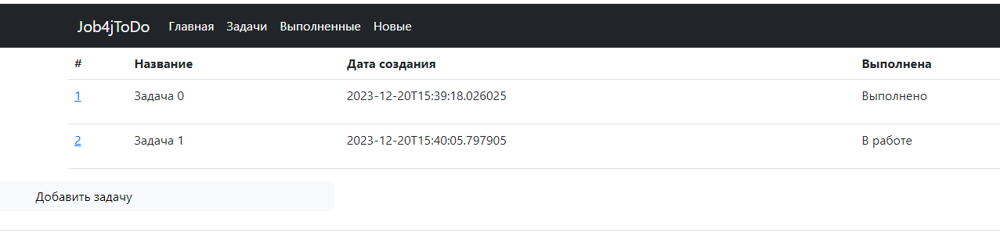
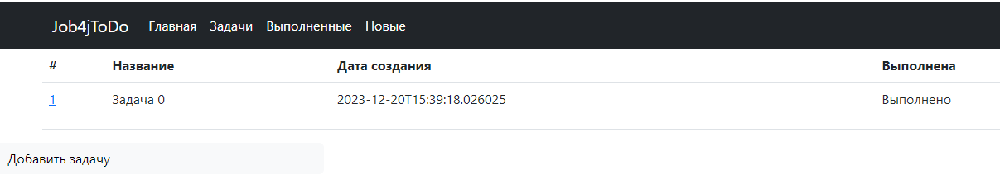
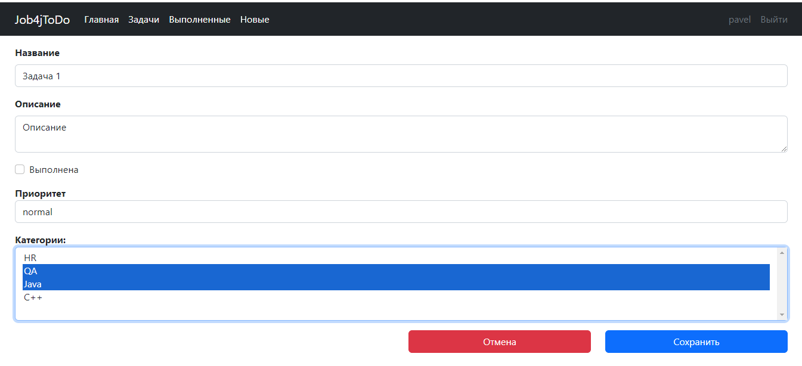
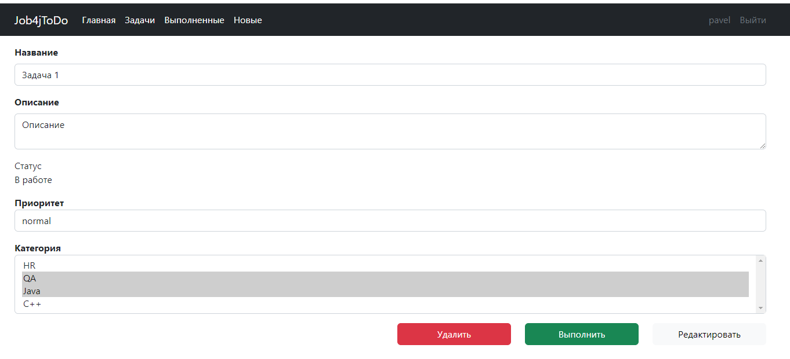
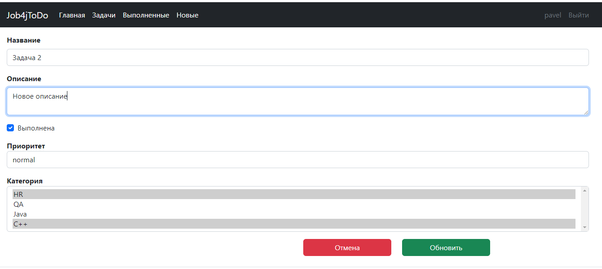

# job4j_todo

http://job4j.ru/
Проект для работы с задачами, с водзможностью добавлять/редактировать/удалять задачи и менять статус.
Можно фильтровать выполненные и невыполненные задачи.

### Требования к окружению:
Java 17,
PostgreSQL 14,
Apache Maven 3.8.4

### Стек технологий: 
Spring boot 2.7.3, 
Thymeleaf, 
Bootstrap, 
Hibernate 5.6.11.Final, 
PostgreSql 42.2.9

### Этапы развертывания проекта:
1. Клонировать проект из этого репозитория;
2. Создать локальную базу данных "todo";
3. Прописать логин и пароль к созданной базе данных в файл db/liquibase.properties и hibernate.cfg.xml;
4. Запустить liquibase для предварительного создания таблиц;
5. Запустить приложение;
6. Открыть в браузере страницу http://localhost:8080/index;

Главная страница и список всех задач:

Фильтрация по выполненным и новым задачам:

Создание задачи и редактирование:

